# 📦 Sistema de Controle de Empréstimos

> **Uma solução completa para gestão de patrimônio emprestado! 🏢📚🔧**

## 🎯 **O que é este projeto?**

Este é um sistema completo de controle de empréstimos de itens do patrimônio, desenvolvido em Django. Mas não é só mais um sistema qualquer - é uma solução real para um problema que afeta muitas organizações!

**A ideia surgiu da observação de necessidades reais:**
- 🏭 **Empresas** que emprestam ferramentas ou máquinas e anotam em planilhas
- 🏫 **Escolas** que emprestam materiais para alunos ou professores
- 🏛️ **Estado ou município** que empresta patrimônios
- 🏢 **Qualquer organização** que precisa controlar o que foi emprestado

**O problema:** Planilhas espalhadas, controle manual, dificuldade para rastrear, falta de relatórios, comunicação manual com funcionários...

**A solução:** Um sistema web completo, automatizado e profissional!

---

## 🚀 **Nossa Jornada de Desenvolvimento**

### **Capítulo 1: A Ideia Original - "Precisamos de um sistema de controle!" 📋**

Tudo começou com uma observação simples: muitas organizações ainda usam planilhas para controlar empréstimos de patrimônio. Isso gera problemas como:

- **Controle manual** - Fácil de perder informações
- **Relatórios difíceis** - Sem visão clara do que está emprestado
- **Comunicação manual** - Lembretes por WhatsApp ou email manual
- **Falta de rastreabilidade** - Difícil saber quem tem o que

**A solução:** Um sistema web que automatize todo o processo!

### **Capítulo 2: O Sistema Completo - "Vamos automatizar tudo!" ⚡**

Desenvolvemos um sistema completo com:

**📊 Gestão Completa:**
- Cadastro de funcionários
- Cadastro de itens do patrimônio
- Controle de empréstimos e devoluções
- Relatórios em PDF
- Sistema de emails automáticos

**📧 Comunicação Automática:**
- Emails automáticos para funcionários
- Lembretes de vencimento
- Confirmações de empréstimo
- Notificações de atraso

**🎨 Interface Moderna:**
- Design responsivo
- Fácil de usar
- Relatórios visuais
- Dashboard intuitivo

---

## 🛠️ **Funcionalidades do Sistema**

### **👥 Gestão de Funcionários**
- Cadastro completo (nome, matrícula, setor, email)
- Edição e exclusão
- Listagem organizada
- Relatórios em PDF

### **📦 Gestão de Itens**
- Cadastro de itens do patrimônio
- Categorização
- Códigos internos
- Status de disponibilidade

### **🔄 Controle de Empréstimos**
- Registro de empréstimos
- Devoluções
- Histórico completo
- Status em tempo real

### **📧 Sistema de Emails Automáticos**
- **Confirmação de empréstimo** - Enviado automaticamente
- **Lembretes de vencimento** - Para itens próximos do prazo
- **Notificações de atraso** - Para itens vencidos
- **Relatórios diários** - Resumo de empréstimos

### **📊 Relatórios e Relatórios**
- **Relatório de Empréstimos** - Todos os empréstimos ativos
- **Relatório de Funcionários** - Lista completa
- **Relatório de Itens** - Inventário do patrimônio
- **Relatório de Devoluções** - Histórico de devoluções

### **🌐 API REST**
- Endpoints para integração
- Documentação Swagger
- Autenticação segura
- Dados em JSON

---

## 🚀 **Como Instalar e Usar**

### **📋 Pré-requisitos**
- Python 3.11+
- Django 4.2+
- pytest 7+
- reportlab 4+
- Selenium 4+
- Redis 5+
- Git
- Conta no Gmail (para envio de emails)

### **⚙️ Instalação Passo a Passo**

#### **1. Clone o repositório**
```bash
git clone https://github.com/Jef-Oliver/controle-emprestimos.git
cd controle-emprestimos
```

#### **2. Crie um ambiente virtual**
```bash
python -m venv venv
# Windows:
venv\Scripts\activate
# Linux/Mac:
source venv/bin/activate
```

#### **3. Instale as dependências**
```bash
pip install -r requirements.txt
```

#### **4. Configure as variáveis de ambiente**
```bash
# Copie o arquivo de exemplo
cp env.example .env

# Edite o arquivo .env com suas configurações
# Especialmente as configurações de email
```

#### **5. Execute as migrações**
```bash
python manage.py migrate
```

#### **6. Crie um superusuário**
```bash
python manage.py createsuperuser
```

#### **7. Execute o servidor**
```bash
python manage.py runserver
```

#### **8. Acesse o sistema**
```
http://localhost:8000
```

### **📧 Configuração de Email (Opcional)**

Para usar o sistema de emails automáticos:

1. **Configure o Gmail:**
   - Ative a verificação em duas etapas
   - Gere uma senha de app
   - Configure no arquivo `.env`

2. **Teste o envio:**
   - Acesse: `http://localhost:8000/relatorios/`
   - Clique em "Enviar Emails Automáticos"

---

## 🎯 **Como Usar o Sistema**

### **📝 Fluxo Básico**

1. **Cadastre Funcionários**
   - Acesse: `http://localhost:8000/funcionarios/`
   - Clique em "Novo Funcionário"
   - Preencha os dados (nome, matrícula, setor, email)

2. **Cadastre Itens**
   - Acesse: `http://localhost:8000/items/`
   - Clique em "Novo Item"
   - Preencha os dados (nome, categoria, código)

3. **Faça um Empréstimo**
   - Acesse: `http://localhost:8000/emprestimos/`
   - Clique em "Novo Empréstimo"
   - Selecione funcionário e item
   - Defina as datas

4. **Sistema Automático**
   - Email de confirmação é enviado automaticamente
   - Lembretes são enviados conforme configurado
   - Relatórios podem ser gerados a qualquer momento

### **📊 Gerando Relatórios**

1. **Acesse a página de relatórios:**
   ```
   http://localhost:8000/relatorios/
   ```

2. **Escolha o relatório:**
   - Relatório de Empréstimos
   - Relatório de Funcionários
   - Relatório de Itens
   - Relatório de Devoluções

3. **Baixe em PDF:**
   - Clique no botão correspondente
   - O arquivo será baixado automaticamente

### **📧 Emails Automáticos**

O sistema envia emails automaticamente:

- **Ao criar empréstimo** - Confirmação para o funcionário
- **Ao devolver item** - Confirmação de devolução
- **Lembretes de vencimento** - Para itens próximos do prazo
- **Notificações de atraso** - Para itens vencidos

**Para testar:**
```
http://localhost:8000/relatorios/
→ Clique em "Enviar Emails Automáticos"
```

---

## 🛠️ **Comandos Úteis**

### **📧 Envio de Emails**
```bash
# Enviar emails para todos os empréstimos
python manage.py enviar_emails_emprestimos --tipo todos

# Enviar emails apenas para atrasados
python manage.py enviar_emails_emprestimos --tipo atrasados

# Enviar email para funcionário específico
python manage.py enviar_emails_emprestimos --funcionario-id 1
```

### **⏰ Agendador Automático**
```bash
# Executar agendador de emails (24/7)
python agendar_emails.py
```

### **🧪 Testes**
```bash
# Executar testes automatizados
python manage.py test

# Executar com cobertura
pytest --cov=core
```

### **📊 Relatórios via Comando**
```bash
# Gerar relatório de empréstimos
python manage.py gerar_relatorio emprestimos

# Gerar relatório de funcionários
python manage.py gerar_relatorio funcionarios
```

---

## 🌐 **API e Documentação**

### **📚 Swagger/OpenAPI**
```
http://localhost:8000/api/docs/
```

### **📖 ReDoc (Alternativa)**
```
http://localhost:8000/api/redoc/
```

### **🔧 Endpoints Principais**
- `GET /api/funcionarios/` - Lista funcionários
- `POST /api/funcionarios/` - Cria funcionário
- `GET /api/items/` - Lista itens
- `POST /api/items/` - Cria item
- `GET /api/emprestimos/` - Lista empréstimos
- `POST /api/emprestimos/` - Cria empréstimo

---

## 🐳 **Docker (Opcional)**

### **🚀 Executar com Docker**
```bash
# Construir e executar
docker-compose up --build

# Executar em background
docker-compose up -d

# Parar
docker-compose down
```

---

## 🤝 **Contribuindo**

1. **Fork o projeto**
2. **Crie uma branch** (`git checkout -b feature/nova-funcionalidade`)
3. **Commit suas mudanças** (`git commit -m 'Adiciona nova funcionalidade'`)
4. **Push para a branch** (`git push origin feature/nova-funcionalidade`)
5. **Abra um Pull Request**

---

## 📄 **Licença**

Este projeto está sob a licença MIT. Veja o arquivo `LICENSE` para mais detalhes.

---

## 📞 **Suporte**

- **Issues:** [GitHub Issues](https://github.com/Jef-Oliver/controle-emprestimos/issues)
- **Documentação:** [Wiki do Projeto](https://github.com/Jef-Oliver/controle-emprestimos/wiki)

---

## 🎉 **Agradecimentos**

Agradecemos a todas as organizações que inspiraram este projeto:
- 🏭 Empresas que emprestam ferramentas
- 🏫 Escolas que emprestam materiais
- 🏛️ Órgãos públicos que gerenciam patrimônio
- 👥 Todos que precisam de controle de empréstimos

**Imagens atuais do projeto** 🚀

<div style="display: grid; grid-template-columns: repeat(3, 1fr); gap: 10px;">

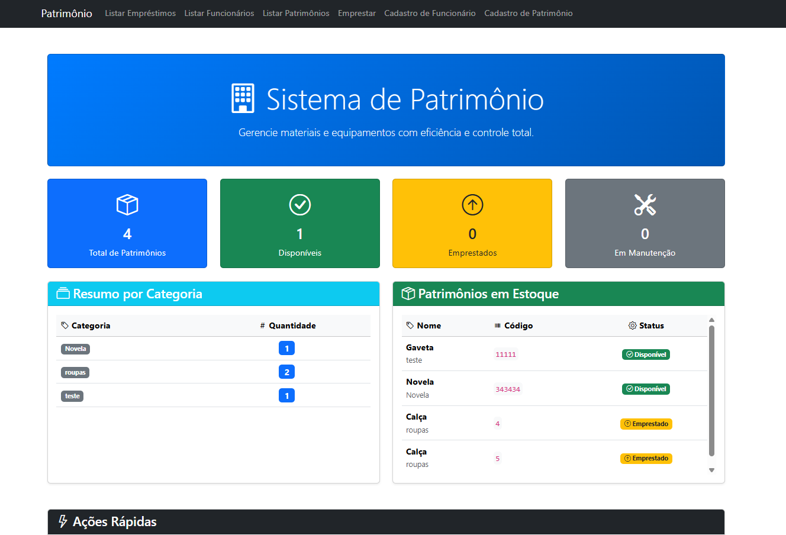
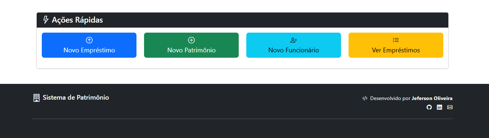
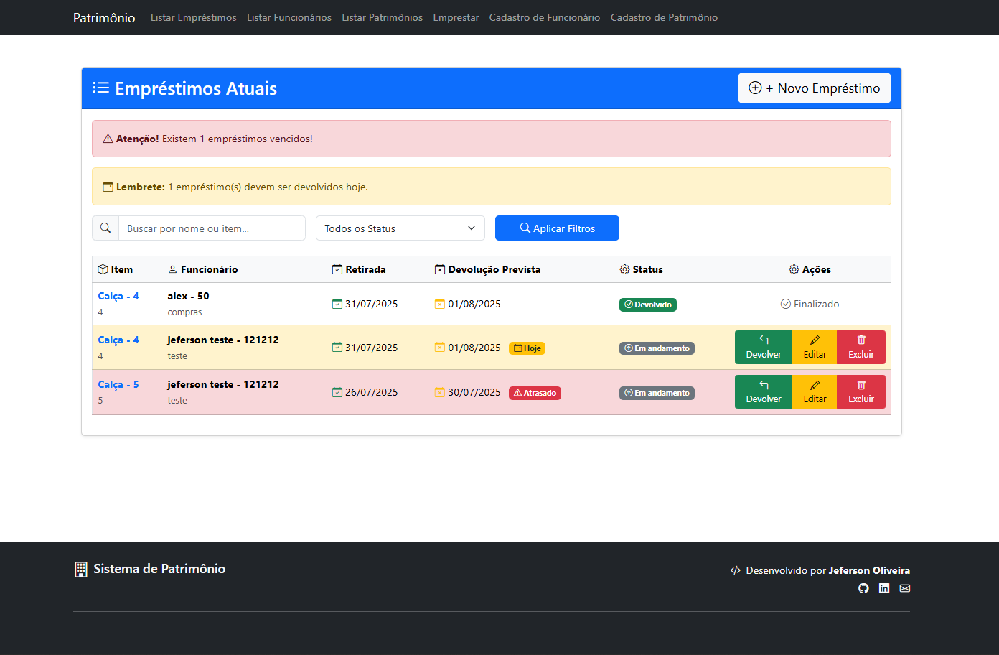

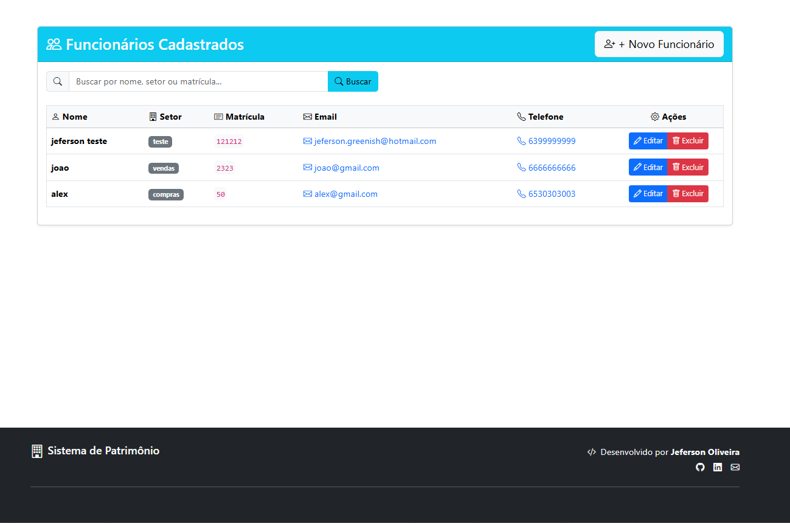
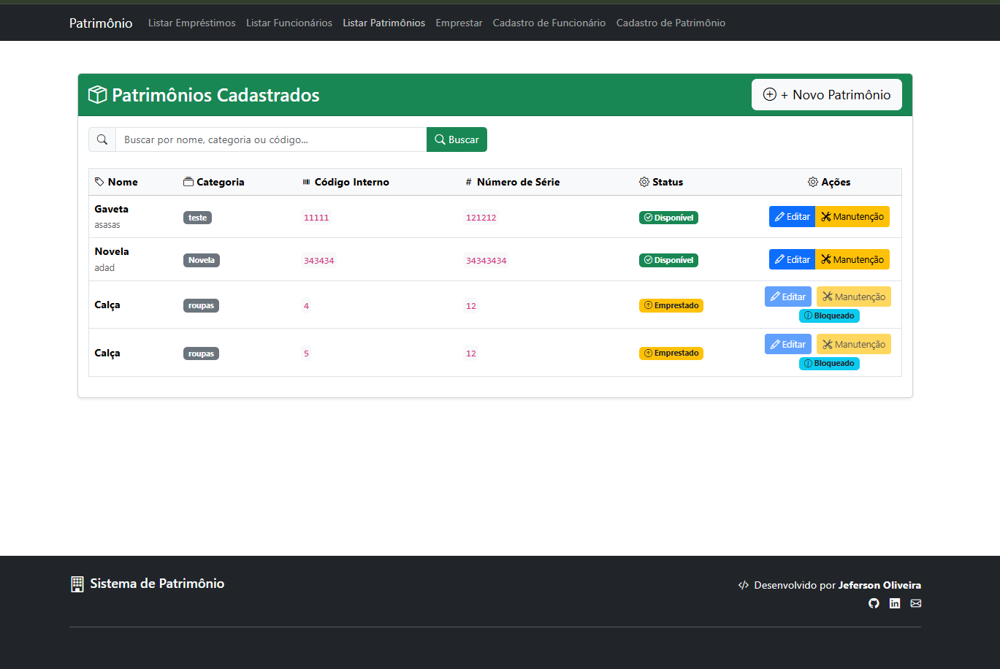
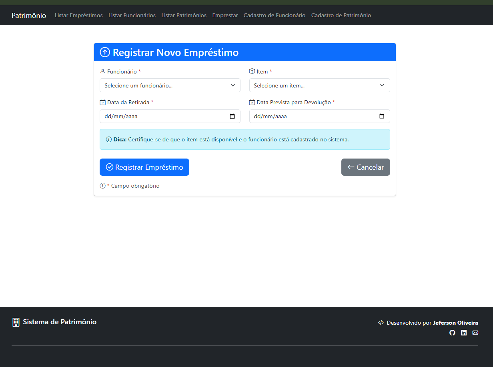

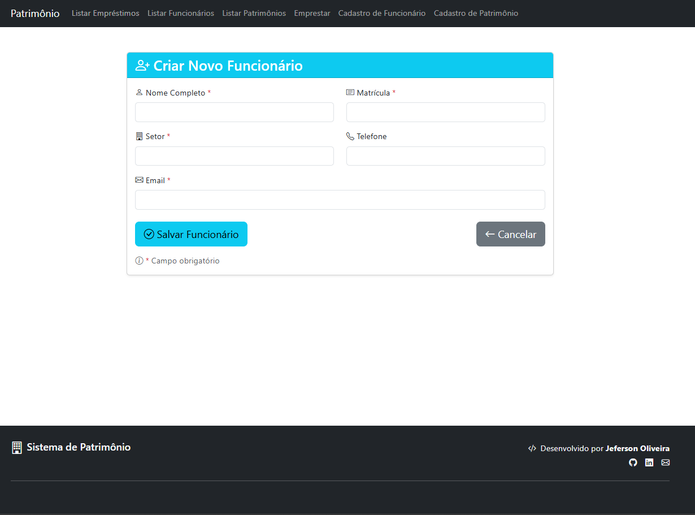
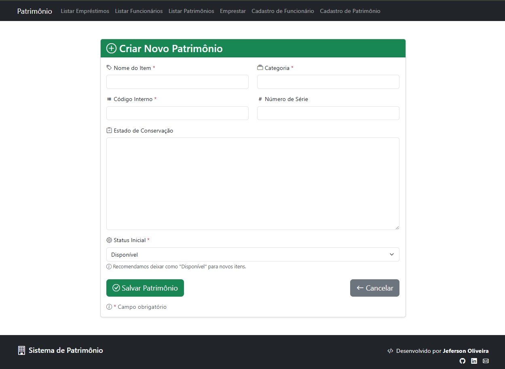
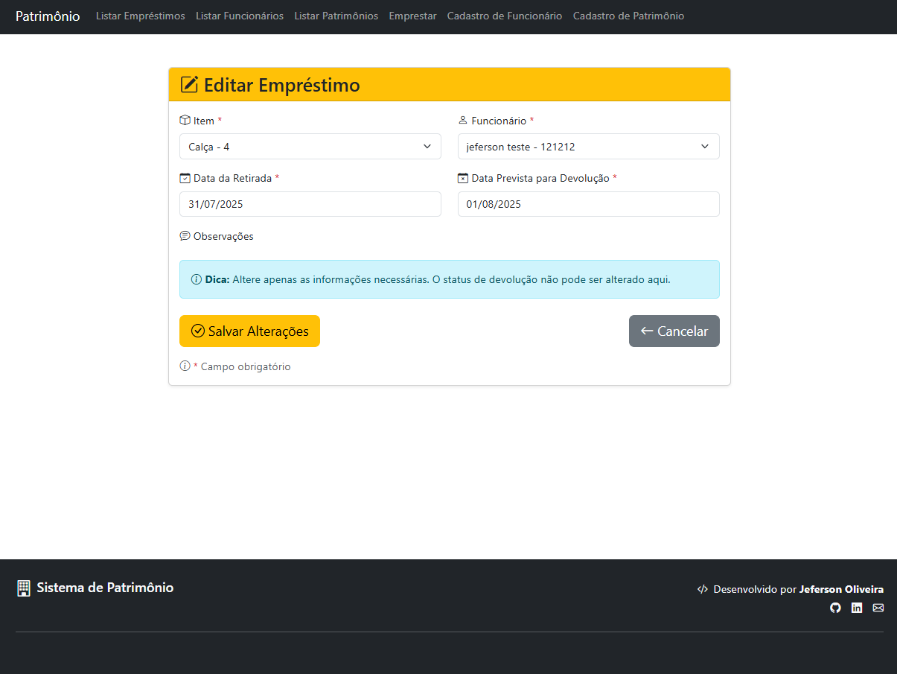

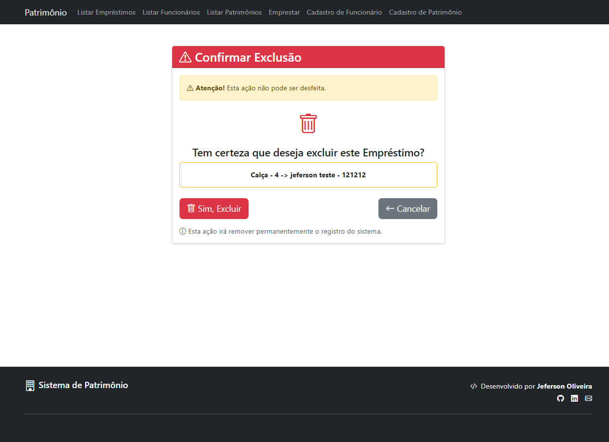
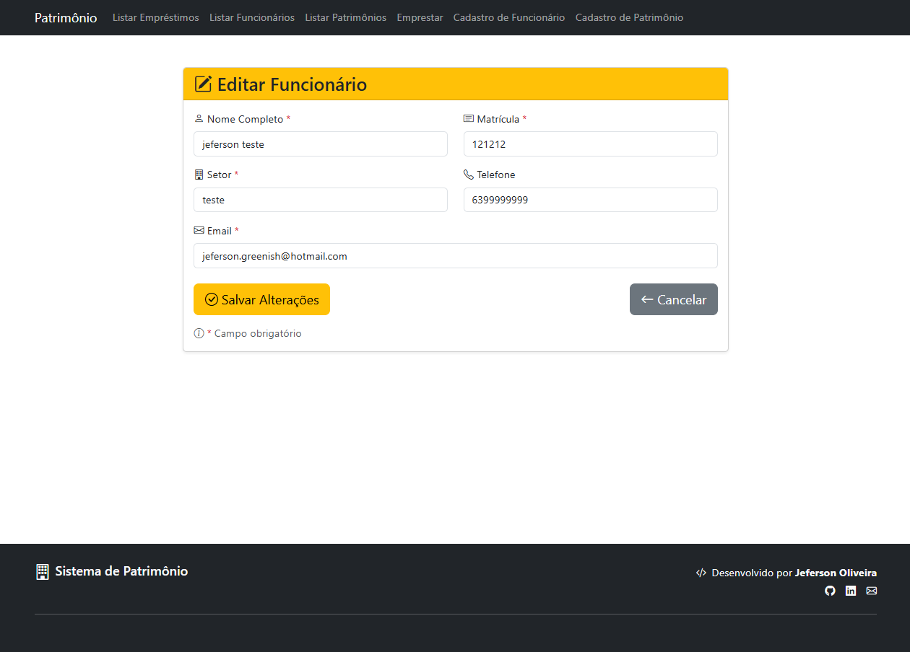
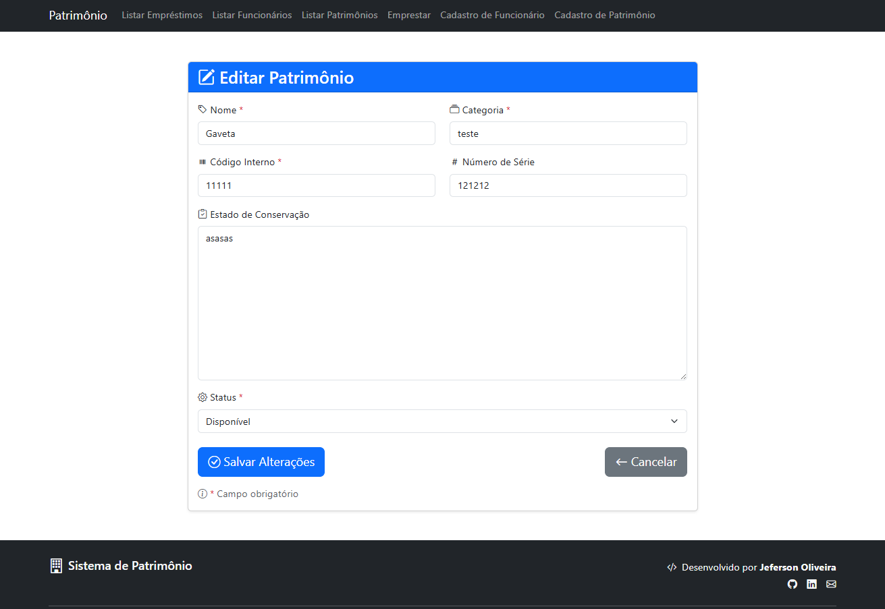
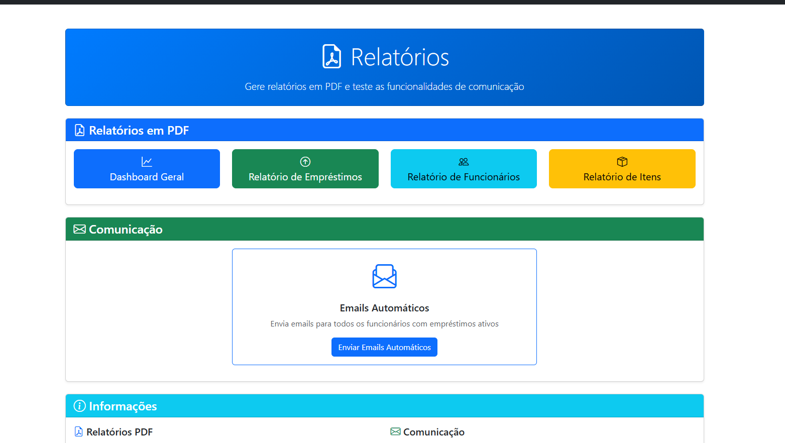
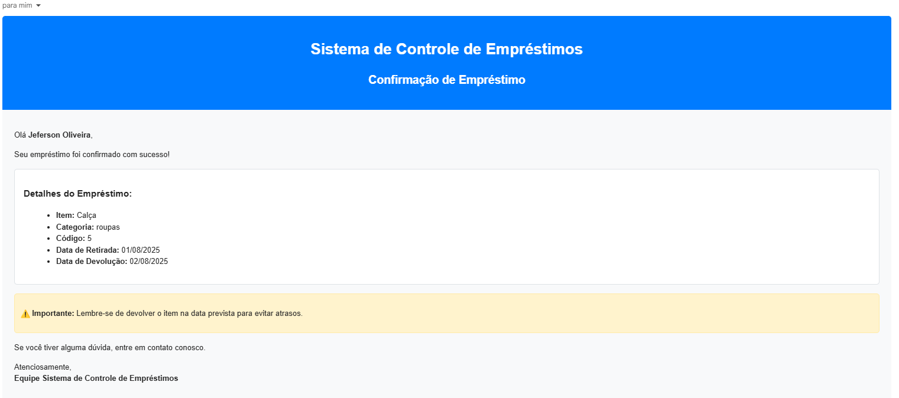
</div>
